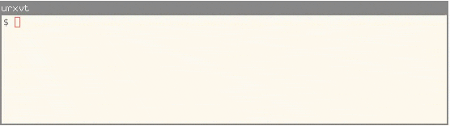

% sloane
% Anders Claesson
% 13 December 2015

# sloane

A command line interface to the
[On-Line Encyclopedia of Integer Sequences](http://oeis.org).



See the [man page](man) for furher uses.

## Install

The easiest way to get started is to download a prebuilt binary. Such
binaries can be found on the
[releases page](https://github.com/akc/sloane/releases).
The binaries are statically linked and should work on any Linux system.

Alternative ways of installing `sloane` include
using the [nix](https://nixos.org/nix/) package manager:

```
$ nix-env -f "<nixpkgs>" -iA haskellPackages.sloane
```

Or using [cabal](https://www.haskell.org/cabal/):

```
$ cabal install sloane
```

## Documentation

- The [man page](man) documents command line options and provides many
  examples.
- How to enable [bash completion](bash-completion).

## Contribute

- [Issue tracker](https://github.com/akc/sloane/issues) on GitHub
- [Source code](https://github.com/akc/sloane) on GitHub
- You can also [contact me](http://akc.is/email/) directly

## How to cite

```
@misc{sloane,
  author = "Anders Claesson",
  title  = "sloane: A command line interface to the OEIS",
  year   =  2015,
  howpublished = "\url{http://akc.is/sloane}"
}
```

## License

This project is licensed under a
[BSD license](https://github.com/akc/sloane/blob/master/LICENSE).
